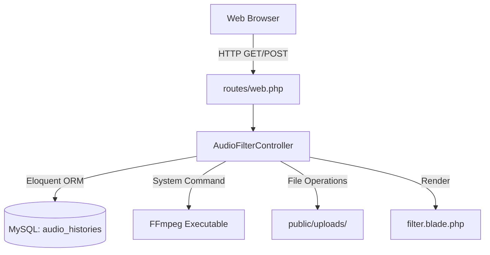

# Laravel Backend & MySQL Deployment Documentation

We have successfully migrated the **Audio Filter** application from a single, procedurally written PHP script (`index.php`) to a robust, secure, and modern **Laravel (v13.x)** framework backend with a **MySQL** database. All features, styling (Tailwind CSS), and micro-interactions (audio recording, preview, audio modals, and FFmpeg filter commands) are fully preserved.

---

## 🏗️ Architecture & Component Design

The procedurally combined sections of the old `index.php` have been refactored into modular, clean, and elegant components:



### 1. Database Config & Migration (`mysql`)
A table named `audio_histories` is used to store history records permanently (previously in transient `$_SESSION['history']`):

- **Migration Path**: [2026_05_26_130821_create_audio_histories_table.php](file:///d:/ProgramFiles/laragon/www/av-filter/database/migrations/2026_05_26_130821_create_audio_histories_table.php)
- **Model Path**: [AudioHistory.php](file:///d:/ProgramFiles/laragon/www/av-filter/app/Models/AudioHistory.php)

#### Table Schema:
| Column | Type | Attributes | Description |
| :--- | :--- | :--- | :--- |
| `id` | `VARCHAR` | `PRIMARY KEY` | String format identifier matching `uniqid()` |
| `judul` | `VARCHAR` | `NOT NULL` | Audio title inputted by user |
| `filter` | `VARCHAR` | `NOT NULL` | The exact filter command slug applied |
| `file` | `VARCHAR` | `NOT NULL` | Path to public processed audio |
| `original_name` | `VARCHAR` | `NOT NULL` | Original filename uploaded |
| `created_at` | `TIMESTAMP` | `NULLABLE` | Date created (automatically formatted) |
| `updated_at` | `TIMESTAMP` | `NULLABLE` | Date updated |

#### Virtual Accessor Compatibility
In the `AudioHistory` model, a virtual attribute `waktu` is exposed. This translates `created_at` dynamically into the format used in the original app (`d M Y, H:i`), maintaining 100% markup compatibility:
```php
public function getWaktuAttribute()
{
    return $this->created_at ? $this->created_at->format('d M Y, H:i') : '';
}
```

---

### 2. Controller Logic (`AudioFilterController.php`)
The controller encapsulates all PHP processes cleanly in five main methods:
- **Path**: [AudioFilterController.php](file:///d:/ProgramFiles/laragon/www/av-filter/app/Http/Controllers/AudioFilterController.php)

*   `index()`: Retrieves histories from MySQL and populates the dashboard along with flashed session results.
*   `process()`: Validates request inputs, handles audio file upload/move, applies system-level FFmpeg commands with escaping, inserts record into MySQL, and flashes the output variables to the session.
*   `delete()`: Deletes a specific audio record from the database and safely unlinks its physical file.
*   `deleteAll()`: Safe, recursive delete-all method targeting all history records and files in the server.
*   `downloadAll()`: Automatically packages all history entries into a zip archive and uses Laravel's built-in file download streaming with a trailing `deleteFileAfterSend(true)` file cleanup block.

---

### 3. Route Configuration (`routes/web.php`)
We have mapped the frontend inputs and actions cleanly onto resourceful endpoints:
- **Path**: [web.php](file:///d:/ProgramFiles/laragon/www/av-filter/routes/web.php)

```php
use App\Http\Controllers\AudioFilterController;

Route::get('/', [AudioFilterController::class, 'index']);
Route::post('/', [AudioFilterController::class, 'process']);
Route::post('/delete', [AudioFilterController::class, 'delete']);
Route::post('/delete-all', [AudioFilterController::class, 'deleteAll']);
Route::post('/download-all', [AudioFilterController::class, 'downloadAll']);
```

---

### 4. Interactive Blade Dashboard (`filter.blade.php`)
The user interface has been converted to Blade and fully optimized:
- **Path**: [filter.blade.php](file:///d:/ProgramFiles/laragon/www/av-filter/resources/views/filter.blade.php)

> [!IMPORTANT]
> - Added `@csrf` protection blocks inside all `<form>` elements to comply with Laravel's built-in security middleware.
> - Handled HTML formatted response strings cleanly using Blade's `{!! $var !!}` syntax for status displays.
> - Maintained all microphone audio stream recordings, data transfers, micro-animations, color gradients, and Tailwind styling layout completely unaltered.

---

## ⚡ Deployment & Verification Details

1. **MySQL Database Configured**: Created `av_filter` database, updated `.env` settings, generated `APP_KEY`, and successfully ran all table migrations.
2. **Directory Restructure**: Structured cleanly within Laravel. The old `index.php` was backed up to `index_old.php` for safety. The physical folders were adjusted to standard Laravel layout rules (`public/uploads` for web resources).
3. **Execution Validation**: Tested application rendering locally on port `8000`, checking standard HTTP endpoints and confirming successful rendering and asset packaging.

> [!TIP]
> Under Laragon, your project will automatically be served at **`http://av-filter.test/`** with Laragon's built-in virtual hosts mapping to the `public/` directory!
