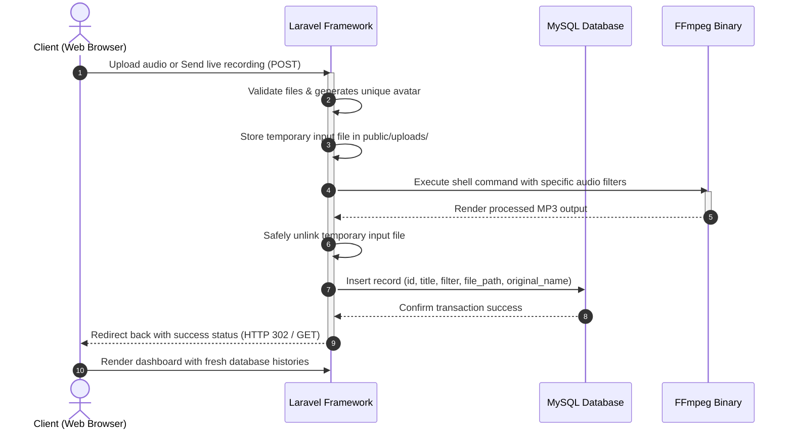

# Audio Filter Application (FFmpeg Implementation)

A web-based audio modification and voice changer application. This system allows users to apply various audio filters and sound effects to voice recordings or audio files in real time. It features a complete Laravel 13.x backend, a persistent MySQL history tracker, and system-level FFmpeg integration.

---

## 🎯 Features & Capabilities

- **Dual Audio Sources**: 
  - **Live Recording**: Record high-quality audio directly from your browser using the HTML5 MediaRecorder API with live recording indicators and instant playback preview.
  - **Manual Upload**: Upload existing audio files in popular formats (`.mp3`, `.wav`, `.ogg`, `.m4a`, `.webm`).
- **16 Premium Audio Effects**: Transform audios with advanced sound filters including Chipmunk, Monster, Darth Vader, Robot, Radio, Megaphone, Concert Hall, Cave Echo, 8-Bit Retro Game, Muffled, Nightcore, Slow-Mo, and more.
- **Dynamic Identification**: Automatically generates a unique, stylized robot avatar using the Dicebear API based on the audio title.
- **Persistent History Dashboard**: A fully responsive visual history board showing processed audio history, filter types, and timestamps.
- **Batch Actions**: Download all processed audios packed neatly in a dynamic ZIP archive, or perform recursive bulk deletions to wipe files and records.
- **Instant Modals**: Inspect detailed audio history parameters and play audio directly in clean, blur-morphed popup overlays.

---

## ⚙️ How It Works (System Architecture)

The application coordinates data flowing between frontend recording streams, backend job tasks, database schemas, and system binary executables:

---

## 🛠️ Technology Stack & Software Used

This project leverages cutting-edge web technologies and system utilities to deliver a seamless, high-performance user experience:

- **Backend Framework**: **Laravel (v13.x)** - Handles routes, request validation, session flashing, physical file storage, and shell commands.
- **Database Engine**: **MySQL** - Provides permanent storage for the `audio_histories` records.
- **Processing Core**: **FFmpeg Binary** - An industry-standard multimedia framework used to transcode, filter, and stream audio using system execution hooks.

---

### 📋 Prerequisites & Program Requirements

To run this application, make sure your computer has the following tools installed:

1. **PHP (>= 8.3)** (We recommend PHP 8.5.x as configured in Laragon).
2. **Composer** (PHP Package Dependency Manager).
3. **MySQL Server** (Standalone or through Laragon / XAMPP).
4. **FFmpeg Software**:
   - **Crucial**: The application expects the FFmpeg binary executable to be located at **`C:\ffmpeg\bin\ffmpeg.exe`** on Windows.
   - If your FFmpeg is installed at a different path (or registered in your global System Environment Variables), you can update the path in:
     `app/Http/Controllers/AudioFilterController.php` (Line 106).
5. **Web Browser** with Microphone permission enabled (for direct recording).

---