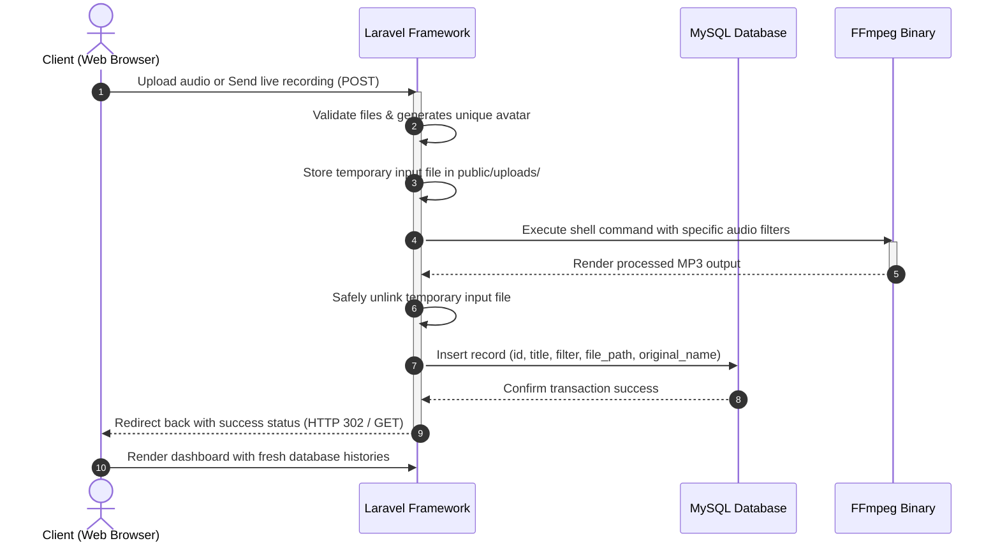

# Audio Filter Application (Laravel & FFmpeg)

A high-premium, interactive web-based audio modification and voice changer application. This system allows users to apply various audio filters and sound effects to voice recordings or audio files in real time. It features a complete Laravel 13.x backend, a persistent MySQL history tracker, live micro-animations, and system-level FFmpeg integration.

---

## 🎯 Features & Capabilities

- **Dual Audio Sources**: 
  - **Live Recording**: Record high-quality audio directly from your browser using the HTML5 MediaRecorder API with live recording indicators and instant playback preview.
  - **Manual Upload**: Upload existing audio files in popular formats (`.mp3`, `.wav`, `.ogg`, `.m4a`, `.webm`).
- **16 Premium Audio Effects**: Transform audios with advanced sound filters including Chipmunk, Monster, Darth Vader, Robot, Radio, Megaphone, Concert Hall, Cave Echo, 8-Bit Retro Game, Muffled, Nightcore, Slow-Mo, and more.
- **Dynamic Identification**: Automatically generates a unique, stylized robot avatar using the Dicebear API based on the audio title.
- **Persistent History Dashboard**: A fully responsive visual history board showing processed audio history, filter types, and timestamps.
- **Batch Actions**: Download all processed audios packed neatly in a dynamic ZIP archive, or perform recursive bulk deletions to wipe files and records.
- **Instant Modals**: Inspect detailed audio history parameters and play audio directly in clean, blur-morphed popup overlays.

---

## ⚙️ How It Works (System Architecture)

The application coordinates data flowing between frontend recording streams, backend job tasks, database schemas, and system binary executables:



---

## 🛠️ Technology Stack & Software Used

This project leverages cutting-edge web technologies and system utilities to deliver a seamless, high-performance user experience:

- **Backend Framework**: **Laravel (v13.x)** - Handles routes, request validation, session flashing, physical file storage, and shell commands.
- **Database Engine**: **MySQL** - Provides permanent storage for the `audio_histories` records.
- **Processing Core**: **FFmpeg Binary** - An industry-standard multimedia framework used to transcode, filter, and stream audio using system execution hooks.
- **Frontend Design**: **Tailwind CSS & JavaScript** - Renders highly optimized responsive components, live recording streams, canvas player states, and backdrop modals.
- **Local Dev Server**: **Laragon** - Recommended local development server on Windows, which automatically maps virtual hosts and documents.

---

## 🚀 Cloning & Installation Guide

Follow these steps to clone, configure, and run this project locally on your machine.

### 📋 Prerequisites & Program Requirements

To run this application, make sure your computer has the following tools installed:

1. **PHP (>= 8.3)** (We recommend PHP 8.5.x as configured in Laragon).
2. **Composer** (PHP Package Dependency Manager).
3. **MySQL Server** (Standalone or through Laragon / XAMPP).
4. **FFmpeg Software**:
   - **Crucial**: The application expects the FFmpeg binary executable to be located at **`C:\ffmpeg\bin\ffmpeg.exe`** on Windows.
   - If your FFmpeg is installed at a different path (or registered in your global System Environment Variables), you can update the path in:
     `app/Http/Controllers/AudioFilterController.php` (Line 106).
5. **Web Browser** with Microphone permission enabled (for direct recording).

---

### 📥 Step-by-Step Installation

#### 1. Clone the Repository
```bash
git clone https://github.com/Rqfi/Audio-Video-Filter.git
cd Audio-Video-Filter
```

#### 2. Install Dependencies
Run composer to install framework packages and components:
```bash
composer install
```

#### 3. Configure the Environment
Copy the environment template file:
```bash
copy .env.example .env
```
Open `.env` in your text editor and specify your MySQL database configurations:
```env
DB_CONNECTION=mysql
DB_HOST=127.0.0.1
DB_PORT=3306
DB_DATABASE=av_filter
DB_USERNAME=root
DB_PASSWORD=
```

#### 4. Generate Application Key
Generate the Laravel secure encryption key:
```bash
php artisan key:generate
```

#### 5. Prepare the Database
Create a MySQL database named **`av_filter`** using your database manager (Laragon Database client, phpMyAdmin, or terminal):
```sql
CREATE DATABASE av_filter CHARACTER SET utf8mb4 COLLATE utf8mb4_unicode_ci;
```

#### 6. Run Database Migrations
Execute the database schemas to create the necessary tables:
```bash
php artisan migrate
```

#### 7. Configure FFmpeg Location
Verify that FFmpeg is installed at `C:\ffmpeg\bin\ffmpeg.exe`. If your installation is located elsewhere, open [AudioFilterController.php](file:///d:/ProgramFiles/laragon/www/av-filter/app/Http/Controllers/AudioFilterController.php) and adjust the path:
```php
// app/Http/Controllers/AudioFilterController.php
$ffmpegCmd = "C:\\ffmpeg\\bin\\ffmpeg.exe -y -i " . escapeshellarg($inputFile);
```

#### 8. Boot Up the Server

- **Option A: Using Laragon (Recommended)**
  If you are running Laragon, simply place this folder inside your Laragon `www/` directory. Laragon will auto-detect the project and serve it instantly at:
  👉 **`http://av-filter.test/`**

- **Option B: Using Laravel Artisan Serve**
  Alternatively, you can run Laravel's internal server:
  ```bash
  php artisan serve
  ```
  Then access the site at:
  👉 **`http://127.0.0.1:8000`**

---

## 🎧 How to Use the Application

1. **Enter Title**: Give your audio a custom title. This automatically generates a robot avatar seed.
2. **Provide Audio Source**:
   - Click **🎙️ Mulai Merekam** and speak into your microphone, then click **⏹️ Hentikan Rekaman** to listen to your preview.
   - Or, simply browse and select an audio file using the manual upload input.
3. **Select Filter**: Choose from the dropdown list of 16 different premium voice modification effects.
4. **Submit**: Click **Submit**. FFmpeg will process the audio in the backend, save its history to MySQL, and output the result.
5. **Download & History**:
   - Play or download your newly modified audio in the center column.
   - Click on any historic record in the right column to open a morph-glass popup detailed preview.
   - Use **Unduh Semua** to pull down a ZIP collection of all processes, or **Hapus Semua** to purge your history.
